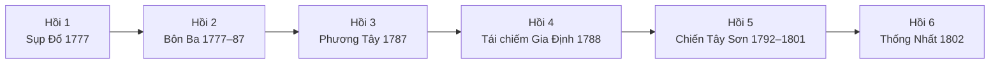
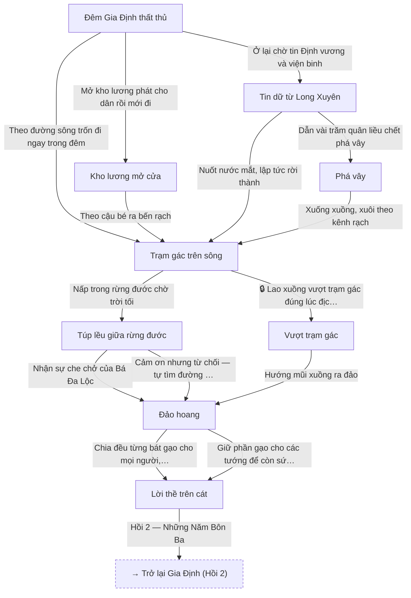
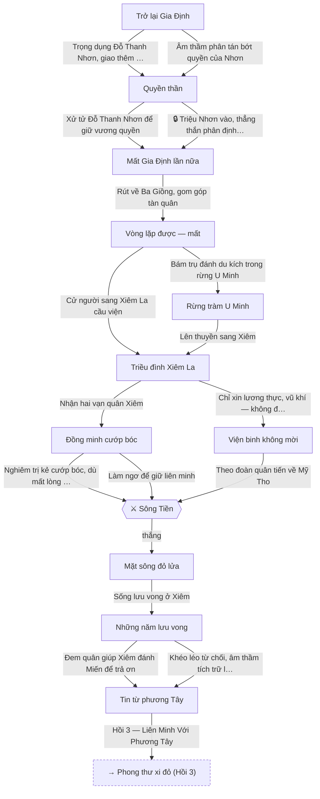
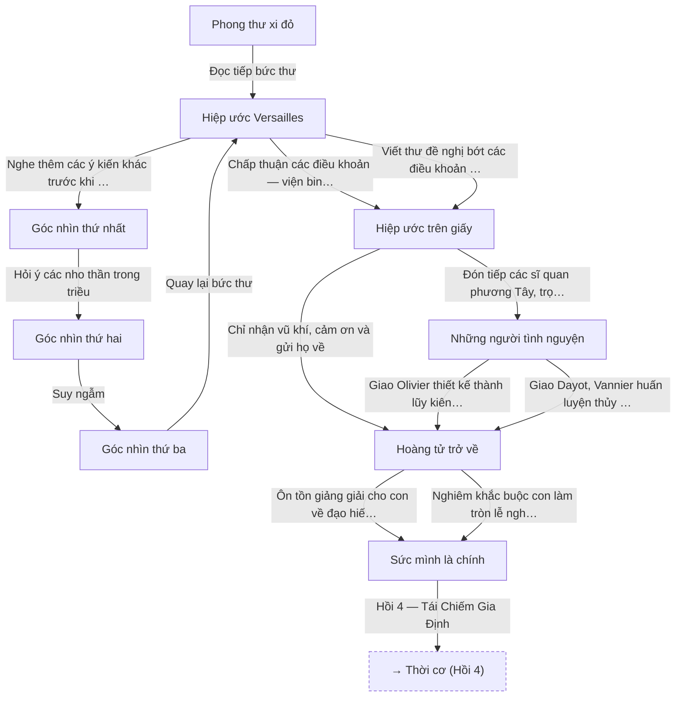
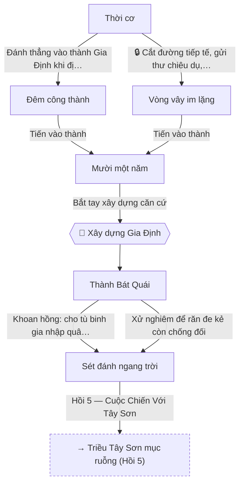
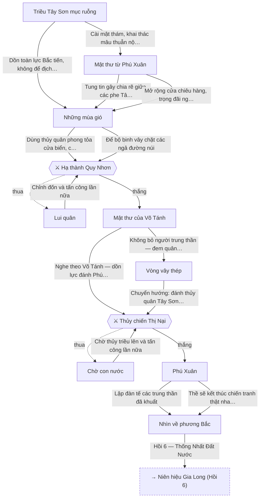
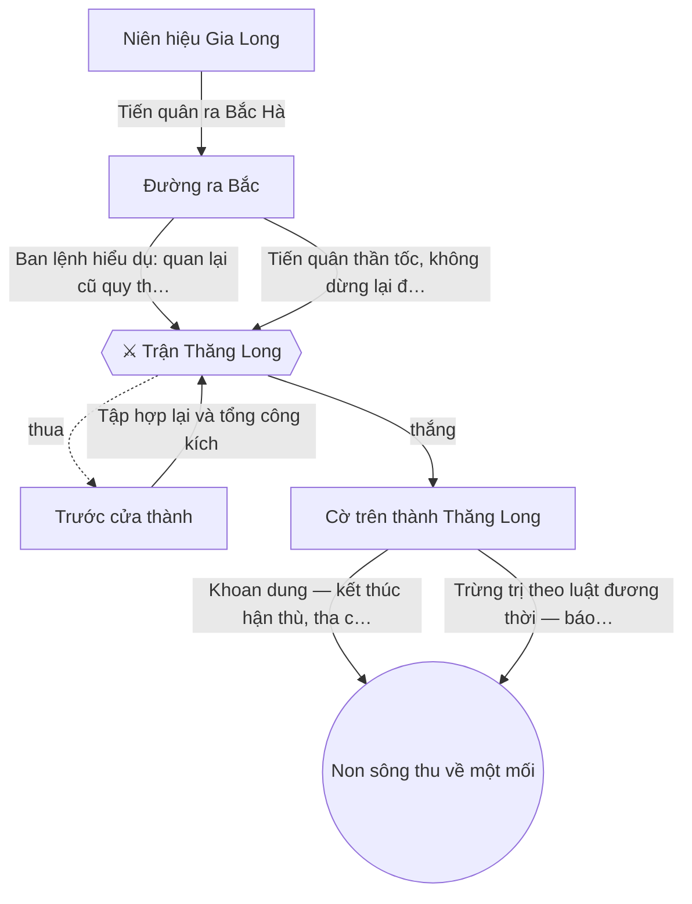

# SƠ ĐỒ LUỒNG GAME

> File này được sinh tự động từ `lib/story/*.dart` — hình chữ nhật: cảnh truyện; hình thoi: trận đánh (⚔) / căn cứ (🏯); hình tròn: kết thúc. Nét đứt: nhánh khi thua trận.

## Tổng quan 6 Hồi

## Hồi 1 — Sụp Đổ Và Chạy Trốn

## Hồi 2 — Những Năm Bôn Ba

## Hồi 3 — Liên Minh Với Phương Tây

## Hồi 4 — Tái Chiếm Gia Định

## Hồi 5 — Cuộc Chiến Với Tây Sơn

## Hồi 6 — Thống Nhất Đất Nước

